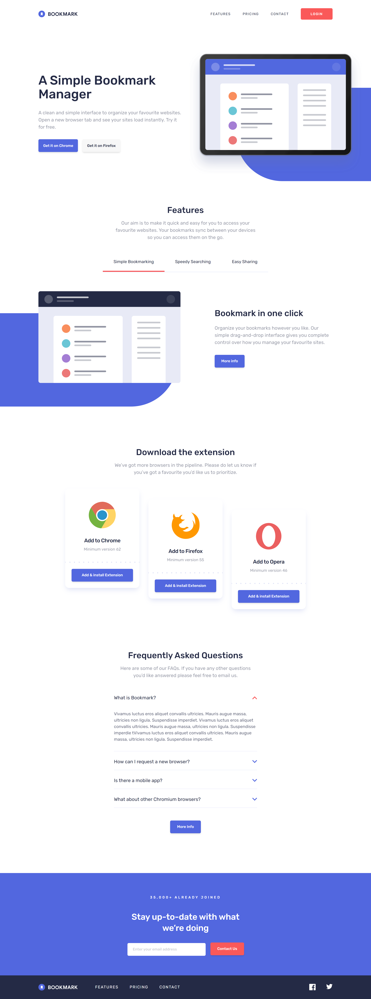
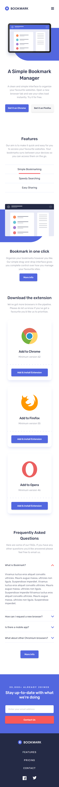
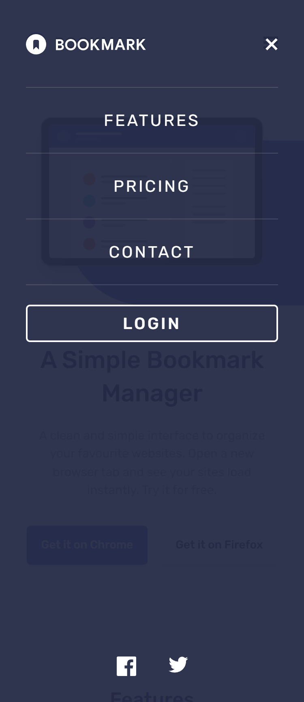

# Frontend Mentor - Bookmark landing page solution

This is a solution to the [Bookmark landing page challenge on Frontend Mentor](https://www.frontendmentor.io/challenges/bookmark-landing-page-5d0b588a9edda32581d29158). Frontend Mentor challenges help you improve your coding skills by building realistic projects. 

### The challenge

Users should be able to:

- View the optimal layout for the site depending on their device's screen size
- See hover states for all interactive elements on the page
- Receive an error message when the newsletter form is submitted if:
  - The input field is empty
  - The email address is not formatted correctly

### Screenshot

### Links

- Live Site URL: [Bookmark Landing Page](https://bookmark-landingpage-ochre.vercel.app/)

### Built with

- HTML5
- Tailwind
- Mobile-first workflow

## Author

-   Website - [Jownsu](https://jownsu.github.io/)
-   Frontend Mentor - [@jownsu](https://www.frontendmentor.io/profile/jownsu)
-   Instagram - [jownsu](https://www.instagram.com/jownsu/)
-   Linked In - [Jhones](https://www.linkedin.com/in/jhones-digno-866904213/)